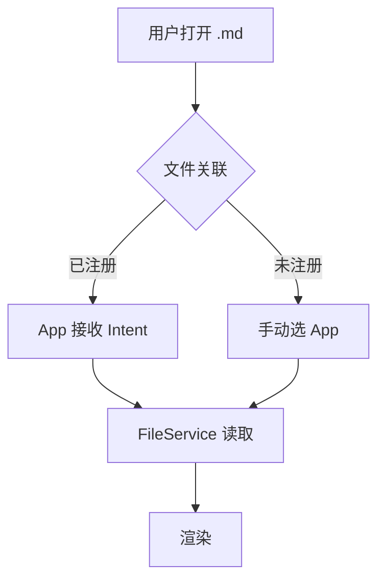
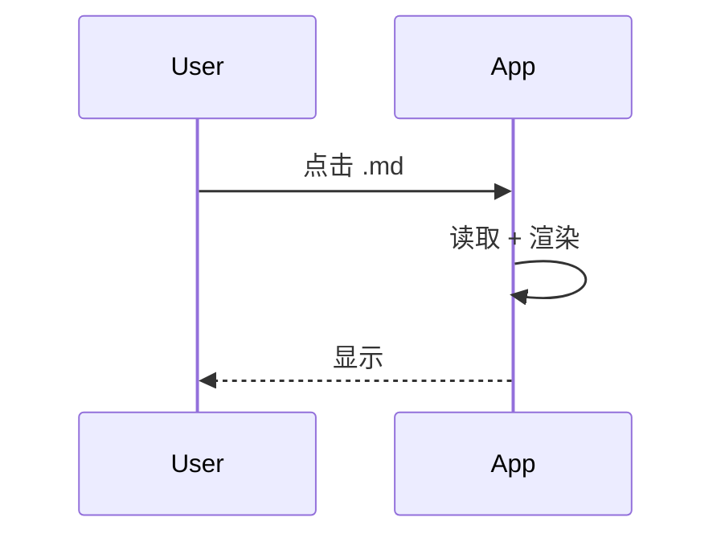
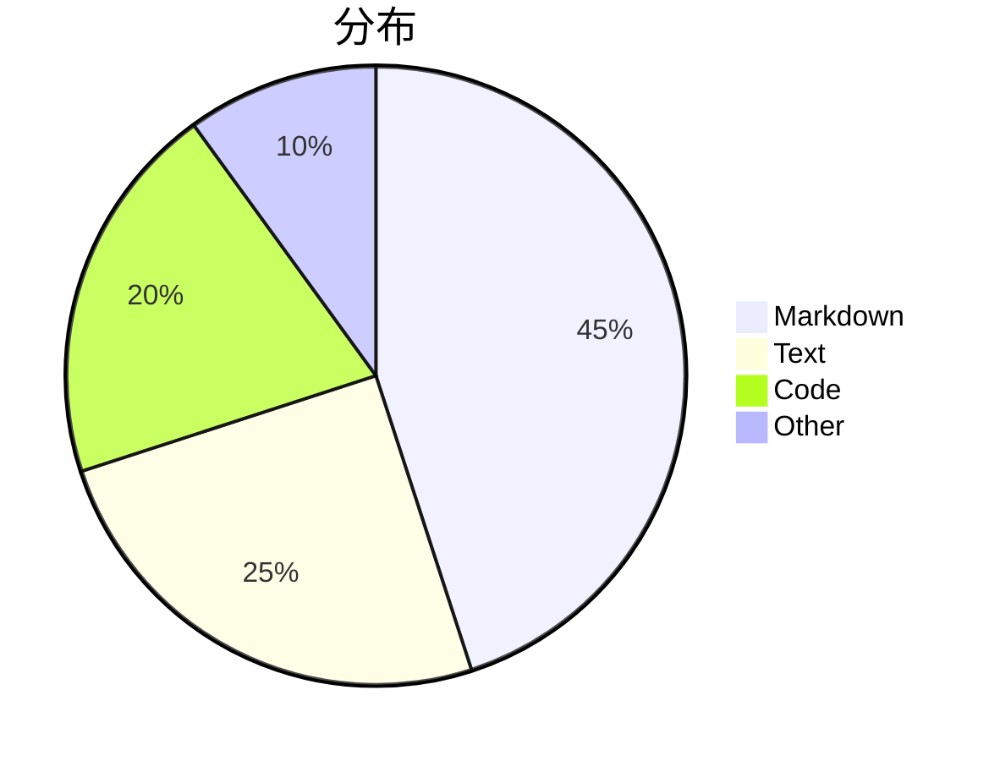

# MD Preview 设备冒烟测试指南

> **目标**：在真实 Android 手机上验证 MD Preview v0.1.0 MVP 的核心功能。
> **预计耗时**：15-30 分钟。
> **前置**：APK 已构建（`build/app/outputs/flutter-apk/app-debug.apk`），手机已连接 USB 并开启 USB 调试。

---

## 0. 一键安装（如果还没装）

```powershell
# 在项目根目录
cd E:\codes\Tools\md_preview
adb install build\app\outputs\flutter-apk\app-debug.apk

# 成功输出示例：
# Performing Streamed Install
# Success
```

如果提示 `INSTALL_FAILED_UPDATE_INCOMPATIBLE`，先卸载：
```powershell
adb uninstall com.mdpreview.md_preview
adb install build\app\outputs\flutter-apk\app-debug.apk
```

---

## 1. 准备测试文件（一次性，~3 分钟）

在 `E:\codes\Tools\md_preview\test_samples\` 下创建下面 5 个文件，**全部复制到手机的 `Download/` 目录**（微信发文件给自己、USB 拖、网盘都行）。

### 1.1 `sample_basic.md` — 基础渲染
```markdown
# 一级标题
## 二级标题
### 三级标题

普通段落。包含 **粗体**、*斜体*、`行内代码` 和 [链接](https://flutter.dev)。

> 引用块
> 多行引用

- 无序列表项 1
- 无序列表项 2
- 有序列表
1. 第一项
2. 第二项

| 列1 | 列2 | 列3 |
|-----|-----|-----|
| A1  | A2  | A3  |
| B1  | B2  | B3  |
```

### 1.2 `sample_code.md` — 代码高亮
````markdown
Dart 代码：
```dart
void main() {
  print('Hello, MD Preview!');
}

class User {
  final String name;
  User(this.name);
}
```

Python 代码：
```python
def fibonacci(n):
    if n <= 1:
        return n
    return fibonacci(n-1) + fibonacci(n-2)
```

SQL 代码：
```sql
SELECT u.name, COUNT(p.id) as post_count
FROM users u
LEFT JOIN posts p ON p.user_id = u.id
GROUP BY u.id
ORDER BY post_count DESC;
```
````

### 1.3 `sample_mermaid.md` — 流程图
````markdown
## 流程图


## 时序图


## 饼图

````

### 1.4 `sample_math.md` — 数学公式
```markdown
行内公式：$E = mc^2$

二次方程：$x = \frac{-b \pm \sqrt{b^2 - 4ac}}{2a}$

求和：$\sum_{i=1}^{n} i = \frac{n(n+1)}{2}$

积分：$\int_{-\infty}^{\infty} e^{-x^2} dx = \sqrt{\pi}$

矩阵：
$$
A = \begin{pmatrix} a & b \\ c & d \end{pmatrix}
$$

高斯分布：
$$
f(x) = \frac{1}{\sigma\sqrt{2\pi}} e^{-\frac{(x-\mu)^2}{2\sigma^2}}
$$
```

### 1.5 `sample_chinese.md` — 中文 + 大文档
```markdown
# 中文测试

这是中文段落。**粗体中文**、*斜体中文*、`代码中文`。

```dart
// 中文注释
String greeting(String name) => '你好，$name';
```

| 表头 1 | 表头 2 |
|--------|--------|
| 内容 1 | 内容 2 |
```

复制这个文件 5-10 份（`sample_chinese_1.md` ... `sample_chinese_10.md`），用于测试大文档滚动。

---

## 2. 启动 + 首页（1 分钟）

| # | 操作 | 预期 |
|---|------|------|
| 2.1 | 桌面找到 **MD Preview** 图标，点击 | 启动 < 2s，无白屏 |
| 2.2 | 观察首页 | 显示 📄 图标 + "No file opened" + "Open Markdown file" 按钮 |
| 2.3 | 点击右上角 ⚙️ | 跳转到 Settings 页（之后可以回退） |

**如果启动崩溃**：看 [§8 调试](#8-调试工具) 拿 logcat。

---

## 3. 文件关联（**核心功能**，5 分钟）

### 3.1 第一次打开
| # | 操作 | 预期 |
|---|------|------|
| 3.1.1 | 打开手机自带「文件管理」/ Files，进入 `Download` | 看到 5 个 sample 文件 |
| 3.1.2 | **长按** `sample_basic.md` | 弹出菜单 |
| 3.1.3 | 点击「打开方式」/ "Open with" | 弹出 App 选择列表 |
| 3.1.4 | 列表里**有** "MD Preview" 吗？ | ✅ 是（首次可能选"仅此一次"） |
| 3.1.5 | 选 "MD Preview" | 直接进入预览页 |
| 3.1.6 | 看 AppBar | 显示 `sample_basic.md` |
| 3.1.7 | 看正文 | 一级/二级/三级标题字号递减；粗体/斜体/链接有样式；引用块有左边竖线；列表缩进；表格有边框 |

📸 **截图保存** `sample_basic.md` 渲染效果。

### 3.2 设置默认打开
| # | 操作 | 预期 |
|---|------|------|
| 3.2.1 | 回到文件管理器，再次长按 `sample_basic.md` | 菜单 |
| 3.2.2 | 「打开方式」→ 选 "MD Preview" | 弹"始终/仅此一次" |
| 3.2.3 | 选「**始终**」 | 设置成功 |
| 3.2.4 | 双击 `sample_basic.md` | **直接**打开，不弹选择框 |

### 3.3 验证所有 sample
| # | 文件 | 预期 |
|---|------|------|
| 3.3.1 | `sample_code.md` | 3 个代码块，Dart/Python/SQL 关键字**有颜色**（`void` `def` `SELECT`） |
| 3.3.2 | `sample_mermaid.md` | 3 个**图表**：流程图节点 + 箭头、时序图 actor + 实线、饼图圆形 + 切片 |
| 3.3.3 | `sample_math.md` | 行内公式 + 矩阵 + 积分都正常排版 |
| 3.3.4 | `sample_chinese.md` | 中文渲染，无乱码 |

📸 **每个 sample 截一张图**。

---

## 4. 应用内手动打开（1 分钟）

| # | 操作 | 预期 |
|---|------|------|
| 4.1 | 杀 App，重启 | 回到首页 |
| 4.2 | 点 "Open Markdown file" | 弹系统文件选择器 |
| 4.3 | 选 `sample_mermaid.md` | 跳预览页，渲染图表 |

---

## 5. 主题切换（1 分钟）

| # | 操作 | 预期 |
|---|------|------|
| 5.1 | 首页 → ⚙️ Settings | Theme 一栏有 "Auto / Light / Dark" 段按钮 |
| 5.2 | 当前应是 "Auto" | 跟随系统 |
| 5.3 | 点 **Light** | App 立即变浅色（< 1s） |
| 5.4 | 点 **Dark** | App 立即变深色 |
| 5.5 | 点 **Auto** | 跟随系统（系统是深色，App 也是深色） |
| 5.6 | Dark 下打开 `sample_mermaid.md` | Mermaid 图表区底色变深 |

📸 **浅色 + 深色各一张**。

---

## 6. 字号调整（**验证上次修的 bug**，2 分钟）

| # | 操作 | 预期 |
|---|------|------|
| 6.1 | 在 Settings 把滑块拖到**最左**（10pt） | 显示 "10 pt" |
| 6.2 | 回到首页，打开 `sample_basic.md` | **正文明显变小**（肉眼可见） |
| 6.3 | 回 Settings 拖到**最右**（32pt） | 显示 "32 pt" |
| 6.4 | 重开 `sample_basic.md` | **正文明显变大**（肉眼可见） |
| 6.5 | 拖到 20pt | 中等字号 |

**关键判断**：同一份 `sample_basic.md` 在 10/20/32 三档下正文行高**明显不同**。如果没区别 — 上次 fix 没生效，立刻告诉我。

📸 **10pt + 20pt + 32pt 各一张**。

---

## 7. 设置持久化（2 分钟）

| # | 操作 | 预期 |
|---|------|------|
| 7.1 | 当前：Dark 主题 + 字号 20pt | 确认 |
| 7.2 | 按最近任务键 → **上滑杀 App** | 完全关闭 |
| 7.3 | 重新启动 MD Preview | 仍然是 Dark + 20pt（**不回到默认**） |
| 7.4 | 完全关机 → 开机 → 启动 | 仍然保持 Dark + 20pt |

**如果回到 Auto + 16** → SharedPreferences 没生效。

---

## 8. 调试工具

### 8.1 拿 logcat（出问题才需要）
```powershell
# 实时看
adb logcat -s flutter:V

# 只看 MD Preview 相关
adb logcat | findstr /I "mdpreview md_preview"

# 保存到文件
adb logcat -d > md_preview_log.txt
```

### 8.2 重新安装（保留数据）
```powershell
adb install -r build\app\outputs\flutter-apk\app-debug.apk
```

### 8.3 完全卸载
```powershell
adb uninstall com.mdpreview.md_preview
```

### 8.4 远程截图
```powershell
# 截图到手机
adb shell screencap -p /sdcard/screen.png
# 拉回电脑
adb pull /sdcard/screen.png C:\Users\lenovo\Desktop\
```

---

## 9. 通过 / 不通过判定

| # | 测试 | 关键 |
|---|------|------|
| ✓ | 启动 | < 2s 显示首页 |
| ✓ | 文件关联 | 长按 → MD Preview 在列表 |
| ✓ | 基础渲染 | heading/list/table/quote 全对 |
| ✓ | 代码高亮 | 关键字有颜色 |
| ✓ | Mermaid | 看到**图形**（不是 `<pre>` 文本） |
| ✓ | KaTeX | 公式正常排版（不是 `$x$` 原文） |
| ✓ | 主题切换 | 即时切换，不需重启 |
| ✓ | **字号调整** | 预览页正文**明显变** |
| ✓ | 持久化 | 杀 App 后设置保留 |

**核心 9 项**必须全过。其它 nice-to-have：

- ✓ WebView 横向滚动（mermaid 宽图）
- ✓ 大文档滚动流畅（10 份 chinese）
- ✓ 错误信息显示（不崩溃）

---

## 10. 反馈给我

跑完后告诉我：
1. **通过 / 不通过**（每个测试组一句话）
2. 任何**截图**直接发我看
3. 任何**logcat 报错**粘出来
4. 任何**行为不对**的描述

我会根据结果决定要不要修。
