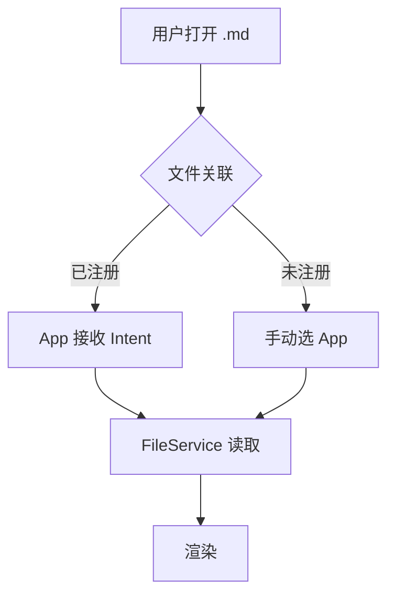
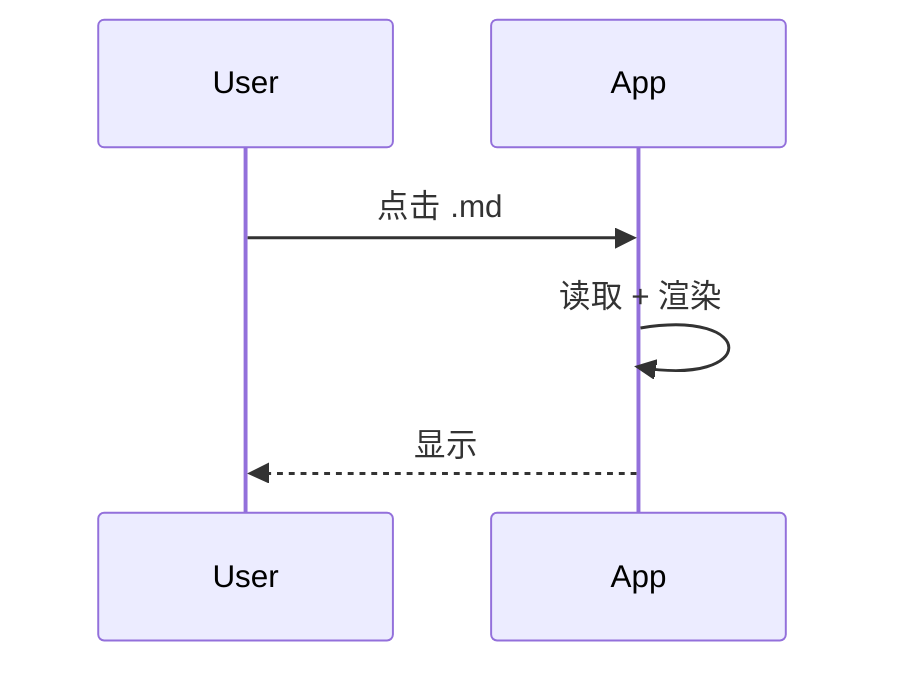
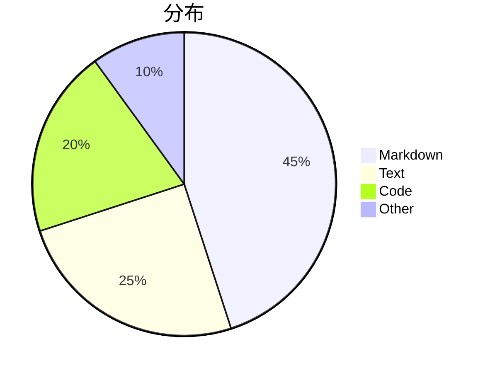

## 流程图

```mermaid
graph TD
    A[用户打开 .md] --> B{文件关联}
    B -->|已注册| C[App 接收 Intent]
    B -->|未注册| D[手动选 App]
    C --> E[FileService 读取]
    D --> E
    E --> F[渲染]
```

## 时序图

```mermaid
sequenceDiagram
    participant U as User
    participant A as App
    U->>A: 点击 .md
    A->>A: 读取 + 渲染
    A-->>U: 显示
```

## 饼图

```mermaid
pie title 分布
    "Markdown" : 45
    "Text" : 25
    "Code" : 20
    "Other" : 10
```
